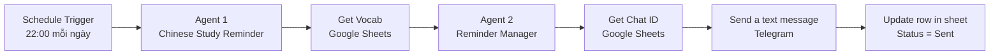

# Chinese Study Reminder: Hệ thống 2 AI Agents nhắc học tiếng Trung tự động

Dự án nhỏ về **Agentic AI** xây dựng trên **n8n**. Hai AI Agent phối hợp để mỗi ngày tự động gửi một lời nhắc học tiếng Trung kèm một từ vựng mới qua Telegram, sau đó ghi lại tiến độ học vào Google Sheets.

---

## 1. Đối chiếu với yêu cầu đề bài

| Yêu cầu | Cách dự án đáp ứng |
|---|---|
| Xây dựng ít nhất **2 AI Agents** | Agent 1 *Chinese Study Reminder* và Agent 2 *Reminder Manager* |
| 2 Agents cùng thực hiện **công việc A** (tự chọn) | Công việc A: nhắc học tiếng Trung hằng ngày kèm từ vựng mới |
| Triển khai **Automation lặp đi lặp lại** | Schedule Trigger chạy lúc 22:00 mỗi ngày, không cần thao tác thủ công |
| **Dự án nhỏ liên quan Agentic AI** | Các agent có vai trò riêng, phối hợp theo chuỗi, dùng dữ liệu ngoài (Google Sheets) và tự cập nhật trạng thái |

---

## 2. Kiến trúc hệ thống



### Vai trò hai agent

| Agent | Nhiệm vụ | Đầu vào | Đầu ra |
|---|---|---|---|
| **Agent 1: Chinese Study Reminder** | Sáng tạo lời nhắc ngắn, dễ thương, động viên, có một câu tiếng Trung | Câu lệnh mặc định (khi chạy theo lịch) | Lời nhắc dạng văn bản |
| **Agent 2: Reminder Manager** | Kết hợp lời nhắc của Agent 1 với từ vựng hôm nay thành tin nhắn hoàn chỉnh, kèm câu ví dụ | Lời nhắc của Agent 1 và một dòng từ vựng | Tin nhắn cuối cùng để gửi Telegram |

### Phần xử lý bằng node thường (không dùng agent)

Các bước cần độ chính xác cao được giao cho node n8n thông thường để hệ thống ổn định:

- **Get Vocab:** lấy 1 từ có `Status = New`.
- **Get Chat ID:** lấy Chat ID người nhận.
- **Update row in sheet:** đánh dấu từ đã gửi (`Sent`) và ghi ngày gửi.

Nguyên tắc thiết kế: **agent làm việc cần sáng tạo, workflow làm việc cần chính xác**.

---

## 3. Công nghệ sử dụng

- **n8n**: nền tảng tự động hóa workflow
- **Google Gemini** (qua node Google Gemini Chat Model): mô hình ngôn ngữ cho hai agent
- **Google Sheets**: lưu từ vựng, trạng thái và Chat ID
- **Telegram Bot API**: gửi lời nhắc đến người dùng

---

## 4. Chuẩn bị

### 4.1. Tạo Telegram Bot

1. Mở Telegram, tìm **@BotFather**.
2. Gửi lệnh `/newbot`, đặt tên và username cho bot.
3. Lưu lại **Bot Token** mà BotFather cung cấp (không đưa token lên GitHub).
4. Nhắn một tin bất kỳ cho bot vừa tạo để bot có thể gửi tin lại cho bạn.

### 4.2. Lấy API key của Google Gemini

1. Truy cập Google AI Studio và tạo API key.
2. Lưu key để dùng khi tạo credential trong n8n.

Lưu ý: gói miễn phí có giới hạn token mỗi phút. Nên chọn model `gemini-2.5-flash` hoặc `gemini-2.5-flash-lite` để tránh lỗi vượt hạn mức.

### 4.3. Tạo Google Sheet

Tạo một file Google Sheets tên **Chinese Reminder** gồm hai tab.

**Tab `Sheet1`** (danh sách người nhận):

| Chat ID | Status |
|---|---|
| 123456789 | Active |

**Tab `Vocab`** (danh sách từ vựng):

| STT | TỪ VỰNG | PINYIN | NGHĨA | Status | LastSent |
|---|---|---|---|---|---|
| 1 | 爸爸 | bàba | ba | New | |
| 2 | 妈妈 | māma | mẹ | New | |
| 3 | 哥哥 | gēge | anh trai | New | |

Lưu ý:
- Giá trị cột `Status` của từ chưa học phải là đúng chữ `New` (viết hoa chữ N).
- Cột `STT` là số duy nhất cho mỗi từ, dùng để khớp dòng khi cập nhật.
- Để biết Chat ID của bạn, chạy thử Telegram Trigger và xem trường `message.chat.id` trong dữ liệu trả về.

### 4.4. Chuẩn bị n8n

Dùng n8n Cloud hoặc tự cài đặt (self-hosted). Nếu chạy trên máy cá nhân (localhost), Telegram Trigger cần địa chỉ HTTPS công khai (ví dụ dùng ngrok). Nếu chỉ cần lịch tự động hằng ngày thì có thể bỏ Telegram Trigger.

---

## 5. Triển khai

### Bước 1. Import workflow

1. Trong n8n, tạo workflow mới.
2. Chọn menu **⋯ → Import from file** và chọn file `workflow/chinese-study-reminder.json`.

### Bước 2. Tạo credentials

Tạo và gắn lại ba credential (file JSON không chứa khóa bí mật):

| Credential | Dùng cho node |
|---|---|
| Telegram API (Bot Token) | Telegram Trigger, Send a text message |
| Google Gemini (PaLM) API | Hai node Google Gemini Chat Model |
| Google Sheets OAuth2 | Get Vocab, Get Chat ID, Update row in sheet |

### Bước 3. Trỏ node tới Google Sheet của bạn

Chọn lại **Document** là file *Chinese Reminder* của bạn trong ba node Google Sheets:

| Node | Tab | Cấu hình chính |
|---|---|---|
| Get Vocab | Vocab | Operation Get Row(s), Filter `Status` = `New`, bật **Return only First Matching Row** |
| Get Chat ID | Sheet1 | Operation Get Row(s) |
| Update row in sheet | Vocab | Operation Update Row, khớp theo cột `STT` |

Cấu hình node **Update row in sheet**:

```text
STT      : {{ $('Get Vocab').first().json.STT }}
Status   : Sent
LastSent : {{ $now.format('yyyy-MM-dd') }}
```

### Bước 4. Chọn model và cấu hình agent

- Ở cả hai node Gemini Chat Model, chọn `gemini-2.5-flash` (hoặc `gemini-2.5-flash-lite`).
- **Agent 1** (Chinese Study Reminder): Prompt type *Define*, gắn Simple Memory với Context Window Length = 2.
- **Agent 2** (Reminder Manager): Prompt type *Define*, đặt **Max Iterations = 5**, không gắn Memory và không gắn tool.

Prompt (Text) của Agent 2:

```text
Lời nhắc từ Agent 1:
{{ $('Chinese Study Reminder').item.json.output }}

Từ vựng hôm nay:
{{ $json['TỪ VỰNG'] }} - {{ $json.PINYIN }} - {{ $json['NGHĨA'] }}
```

System Message của Agent 2:

```text
Bạn là AI Agent 2 - Study Manager.
Bạn nhận lời nhắc của Agent 1 và một từ vựng hôm nay.
Giữ giọng cute, ngắn gọn của lời nhắc, rồi thêm cuối tin mục "Từ hôm nay" gồm chữ Hán, pinyin và nghĩa, kèm một câu ví dụ ngắn.
Chỉ trả về văn bản thuần, không Markdown table, không ký tự |, không tiêu đề, không giải thích, không dấu ngoặc kép bao quanh.
```

System Message của Agent 1: mô tả một trợ lý nhắc học tiếng Trung với phong cách cute, gần gũi, ngắn gọn, có emoji vừa phải, không trách móc, luôn động viên, mỗi lời nhắc có một câu tiếng Trung đơn giản. Bản đầy đủ nằm trong file workflow JSON.

### Bước 5. Cấu hình lịch chạy

- Node **Schedule Trigger**: chạy mỗi ngày lúc 22:00.
- Trong **Settings** của workflow, đặt **Timezone = Asia/Ho_Chi_Minh** để giờ chạy đúng với giờ Việt Nam.

### Bước 6. Cấu hình gửi tin Telegram

Node **Send a text message**:

```text
Chat ID : {{ $('Get Chat ID').item.json['Chat ID'] }}
Text    : {{ $('Reminder Manager').item.json.output }}
```

---

## 6. Kiểm thử

1. Bấm **Execute workflow** để chạy thử toàn bộ.
2. Kiểm tra từng điểm:
   - Get Vocab trả về đúng **1 item**.
   - Agent 2 chạy **1 lần** (không lặp vòng).
   - Telegram nhận được tin nhắn có mục "Từ hôm nay".
   - Dòng từ vựng tương ứng trong tab Vocab đổi thành `Sent` và có ngày ở cột `LastSent`.
3. Chạy lần thứ hai: bot phải gửi **từ tiếp theo**, không lặp lại từ cũ.

Ví dụ tin nhắn nhận được:

```text
Hi bạn! Đến giờ "tám" với tiếng Trung một lát rồi nè 🐣

Không cần học nhiều đâu, hôm nay mình chỉ cần xem qua vài từ mới là siêu lắm rồi 📚✨

你今天真棒！🌱 (Hôm nay bạn thật tuyệt vời!)

Học một xíu thôi rồi nghỉ ngơi nha, cố lên nè! 💗

Từ hôm nay
爸爸 bàba ba
我爱爸爸。 (Wǒ ài bàba - Con yêu ba)
```

---

## 7. Vận hành

1. Chuyển workflow sang trạng thái **Active** (Publish). Nếu chưa bật Active, lịch 22:00 sẽ không chạy.
2. Theo dõi lịch sử chạy trong mục **Executions** của n8n.
3. Khi hết từ có `Status = New`, workflow sẽ không gửi tin nữa. Hãy bổ sung từ mới vào tab Vocab, hoặc đổi `Status` về `New` để học lại.

---

## 8. Xử lý lỗi thường gặp

| Lỗi | Nguyên nhân | Cách xử lý |
|---|---|---|
| `429 You exceeded your current quota` | Vượt hạn mức token miễn phí của Gemini | Chờ khoảng 1 phút, đổi sang `gemini-2.5-flash` hoặc `gemini-2.5-flash-lite`, bỏ Memory không cần thiết |
| `Max iterations reached` | Agent gọi tool lặp vòng hoặc prompt yêu cầu tool không tồn tại | Dùng node Google Sheets thường để lấy và cập nhật dữ liệu, gỡ tool khỏi agent, giữ Max Iterations = 5 |
| Get Vocab trả về nhiều dòng | Chưa bật Return only First Matching Row | Bật tùy chọn này trong Options của node |
| Update row báo lỗi cột | Tên cột không khớp với sheet | Dùng đúng tên cột `STT`, `Status`, `LastSent` |
| Telegram: `chat not found` | Chat ID sai hoặc bạn chưa nhắn cho bot | Nhắn tin cho bot trước, kiểm tra lại cột `Chat ID` |
| Không kích hoạt được Telegram Trigger | n8n chạy localhost không có HTTPS | Dùng ngrok hoặc bỏ Telegram Trigger vì lịch hằng ngày không cần nó |
| Workflow không tự chạy lúc 22:00 | Workflow chưa Active hoặc sai múi giờ | Bật Active, đặt timezone `Asia/Ho_Chi_Minh` |

---

## 9. Minh chứng nên chụp khi nộp bài

- Sơ đồ toàn bộ workflow trong n8n.
- Cấu hình hai agent (Prompt, System Message, model).
- Tab Vocab trước và sau khi chạy (cột `Status`, `LastSent`).
- Tin nhắn nhận được trên Telegram.
- Mục Executions thể hiện workflow đã chạy tự động theo lịch.

---

## 10. Hạn chế và hướng mở rộng

**Hạn chế hiện tại**
- Gửi cho một người dùng (Chat ID nhập sẵn trong sheet).
- Agent 2 chưa tự gọi tool, dữ liệu từ vựng được lấy bằng node thường.
- Nhánh Telegram Trigger (nếu giữ lại) cũng tiêu thụ một từ vựng mỗi lần có tin nhắn.

**Hướng mở rộng**
- Tự đăng ký nhiều người dùng: khi ai đó nhắn bot, dùng node *Append or Update Row* để lưu Chat ID với `Status = Active`, và lọc người nhận theo `Status`.
- Cho Agent 2 dùng tool đọc Google Sheets để tự chọn từ phù hợp (ví dụ chọn từ theo chủ đề).
- Thêm bài kiểm tra ngắn hằng tuần để ôn lại các từ đã gửi.
- Theo dõi tiến độ riêng cho từng người dùng bằng cột tiến độ theo Chat ID.
- Gửi báo cáo tuần tổng kết số từ đã học.

---

## 11. Cấu trúc repository

```text
chinese-study-reminder/
├── workflow/
│   └── chinese-study-reminder.json
├── data/
│   └── vocab-sample.csv
├── docs/
│   └── (ảnh chụp workflow, Telegram, Google Sheet)
├── README.md
└── .gitignore
```

## 12. Bảo mật

- Không đưa Bot Token Telegram, API key Gemini hay Chat ID thật lên GitHub.
- File export workflow của n8n không chứa khóa bí mật, nhưng nên thay ID Google Sheet bằng `YOUR_SHEET_ID` nếu để repo public.
- Người dùng khác phải tự tạo credentials của riêng mình khi import workflow.
